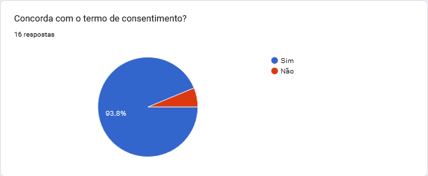

# Perfil do Usuário

    A definição de um perfil de usuário é muito importante
    para o projeto pois a partir disso é possível conhecer os
    usuários que utilizarão o sistema, quais seus interesses e quais suas 
    características (como idade, experiência e quais as atividades
    que irão realizar utilizando o projeto).
     

   
    O grupo decidiu utilizar questionários para realizar o levantamento
    do perfil. Dessa forma modelamos as personas, baseado num resultado
    homogêneo já que o nosso projeto é baseado no site do CIEE, uma plataforma
    utilizada comumente entre estudantes do ensino médio e ensino superior.

## Questionário

    Sobre o questionário podemos dizer que é um documento pré-impresso em que serão preenchidos os dados e informações, 
    que permite a formalização das comunicações, o registro e o controle de informações.
    Utilizamos desse formulário para conseguir informações sobre os usuários que utilizam o site do CIEE,
    a fim de criar nossas personas baseadas em dados reais. 
 

 
### Resultado Estatístico:
 
 
 
 
 
 
 
 
 
 
 

Analisando os dados levantados conclui-se que o perfil do usuário que utilizam regularmente a plataforma do CIEE consiste de estudantes que estão cursando o ensino médio com faixa etária dos 14 aos 24 anos. Sendo assim, a equipe direcionará o projeto para esse perfil de usuário que está descrito na tabela 1 logo abaixo.

| Perfil | Estudante |
|--|:-:|
| Quantidade de estudantes entre os pesquisados | **100%** |
| Percentual de estudantes do sexo masculino | **66,7%** |
| Percentual de estudantes do sexo feminino | **33,3%** |
| Faixa Etária | **14 a 24 anos** |
| Nível de escolaridade  (E.M. = ensino médio, E.S. = ensino superior) | **EM. Completo: 86,7%**  **ES. completo: 13,3%** |
| Conseguiu agendar entrevista em estágio ou aprendiz | **33,3%** |
| Conseguiu estágio ou aprendiz | **16,7%** |

&emsp;&emsp;&emsp;&emsp;&emsp;Tabela 1 - Perfil do Usuário

## Bibliografia

BARBOSA, Simone. SILVA Bruno. "Interação Humano-Computador".
 
 ## Versionamento

| Data       | Versão | Descrição                                  | Autor(es)      | Revisor(es)  |
| ---------- | ------ | ------------------------------------------ | -------------- | ------------ |
| 19/06/2022 | 1.0    | Criação do documento                       | Luis Henrique  | Pedro Henrique Bragança |
| 20/06/2022 | 1.1    | Adicionando informações sobre o perfil de usuario e  questionário | Luis Henrique  | Pedro Henrique Bragança |
| 20/06/2022 | 1.2    | Adicionando tabela com o perfil do usuário e bibliografia | Luis Henrique  | Pedro Henrique Bragança |
